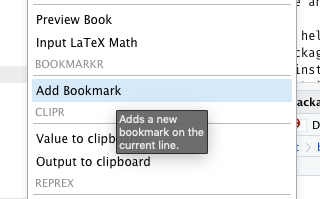
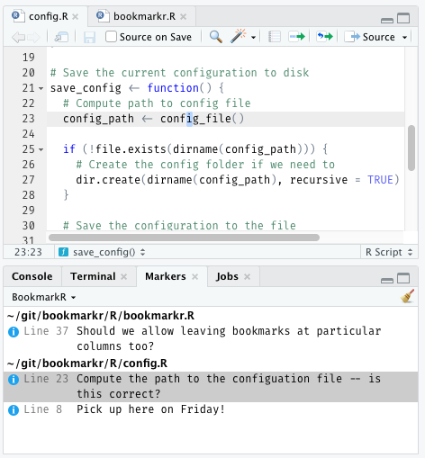

## bookmarkR 

This is a simple RStudio add-in that allows you to add markers (bookmarks) to your R code. You can view your list of bookmarks and jump to them quickly.

### Installing

Currently this package exists only on Github. You can install it as follows at the R console:

    > devtools::install_github("jmcphers/bookmarkr")

### Adding Bookmarks

After installation, you'll get a new "Add Bookmark" menu item in your Add-Ins menu.

Click this to add a note at your current cursor position. Your collection of notes will be displayed in the *Markers* pane in RStudio.

### Keyboard shortcut

The add-in does not ship with a keyboard shortcut, but you can assign one so that it's easy to drop notes into your code quickly, without using the mouse. Here's how:

1. Click the Tools menu, then Modify Keyboard Shortcuts
2. In the list, look for "Add Bookmark"
3. Click the *Shortcut* column in the "Add Bookmark" row
4. Press your desired shortcut key (note that you can use a key sequence, too!)

### Known issues

- Bookmark line numbers can be incorrect after adding a new bookmark; adding a bookmark requires us to re-play all of the previous bookmarks, but the lines to which they refer may have moved
- Bookmarks are user scoped (should probably be project scoped?)
- Currently no way to delete a bookmark

